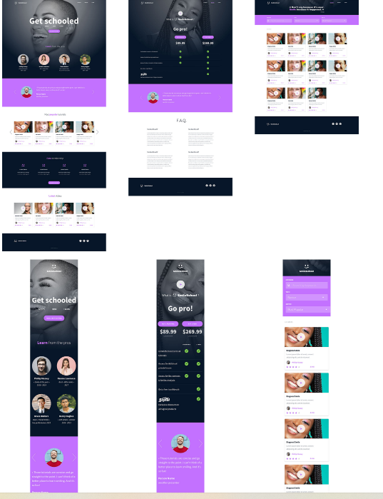

# **0x01. Implement a design with bootstrap**

## In this project, I implemented 3 web pages with Bootstrap. Used HTML/CSS/Accessibility/Responsive design/Bootstrap

## Objective: Have fully functional web pages that look the same as the designer file.

### Here the final result:

  

